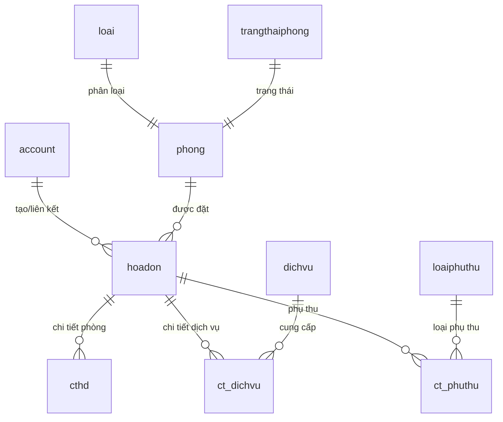

# 🏨 Hướng Dẫn Nghiệp Vụ Lễ Tân - MAY HOTEL

## Tổng quan Project

Project **quan_ly_khach_san** là một hệ thống quản lý khách sạn xây dựng theo kiến trúc:
- **Backend**: PHP Laravel (chạy port `8080`)
- **Frontend**: HTML + Vanilla JS + Bootstrap 5 (thuần, không dùng framework)
- **Database**: MySQL (`quanlykhachsan`)
- **AI Chatbot**: Python (port `5000`)

---

## 🗺️ Cấu Trúc Project (Toàn cảnh)

```
quan_ly_khach_san/
├── app/                          ← BACKEND LOGIC (PHP Laravel)
│   ├── Http/
│   │   ├── Controllers/
│   │   │   └── Api/
│   │   │       ├── Admin/        ← Controller cho Admin
│   │   │       ├── Staff/        ← ⭐ Controller cho LỄ TÂN (chỗ bạn làm)
│   │   │       ├── Client/       ← Controller cho Khách hàng
│   │   │       └── Auth/         ← Controller Auth (Login/Logout)
│   │   └── Requests/
│   ├── Models/                   ← Các Model (bảng CSDL)
│   └── Services/
├── routes/
│   └── api.php                   ← ⭐ Định nghĩa tất cả API routes
├── frontend/                     ← FRONTEND (HTML/JS)
│   ├── staff/
│   │   └── room-map/             ← ⭐ Sơ đồ phòng (Lễ tân dùng)
│   ├── admin/
│   │   ├── check-in/             ← ⭐ Trang Check-in
│   │   ├── check-out/            ← ⭐ Trang Check-out
│   │   └── invoice/              ← ⭐ Quản lý Hóa đơn
│   ├── app.js                    ← JS chung toàn app (menu, phân quyền)
│   └── layout.js                 ← Layout JS
└── database/
    └── QLKS.sql                  ← File SQL (schema + dữ liệu mẫu)
```

---

## 👔 Vai Trò Lễ Tân trong Hệ Thống

Trong CSDL, vai trò được lưu ở bảng `role`:

| RoleID | ChucVu |
|--------|--------|
| 1 | Admin |
| **2** | **Nhân viên (Lễ tân)** ← Bạn đây! |
| 3 | Khách hàng |

Tài khoản test lễ tân mặc định: `letan / 123456`

---

## 🗄️ Các Bảng CSDL Quan Trọng Cho Lễ Tân



### Bảng `phong` (Phòng)
| Cột | Ý nghĩa |
|-----|---------|
| `ID` | Mã phòng |
| `Name` | Tên phòng (VD: P101) |
| `Price` | Giá/đêm |
| `MaLoai` | FK → bảng `loai` |
| `MaTrangThai` | **1=Trống, 2=Đang có khách, 3=Đang dọn dẹp, 4=Bảo trì** |

### Bảng `hoadon` (Hóa đơn / Booking)
| Cột | Ý nghĩa |
|-----|---------|
| `MaHD` | Mã hóa đơn |
| `HoTen` | Tên khách |
| `DienThoai` | SĐT khách |
| `NgayNhan` | Ngày nhận phòng (Check-in) |
| `NgayTra` | Ngày trả phòng (Check-out) |
| `TongTien` | Tổng tiền |
| `DaThanhToan` | **0=Chưa TT, 1=Đã TT** |
| `MaPhong` | FK → bảng `phong` |
| `GhiChu` | Ghi chú nghiệp vụ (lễ tân ghi vào đây) |
| `PhuongThucThanhToan` | Tiền mặt / Online |

---

## 🎯 Nhiệm Vụ Lễ Tân - 4 Chức Năng Chính

```
📌 NHIỆM VỤ CỦA BẠN
┌─────────────────────────────────────────────────────────┐
│  1. 🗺️  Xem Sơ đồ phòng trực quan                       │
│  2. ✅  Xử lý Check-in (Nhận phòng)                      │
│  3. 🚪  Xử lý Check-out (Trả phòng)                      │
│  4. 📋  Quản lý Hóa đơn (Xem, In, Xóa)                  │
└─────────────────────────────────────────────────────────┘
```

---

## 🔄 Luồng Hoạt Động (Flow)

```
Khách đặt phòng online/chatbot
        ↓
    [hoadon] tạo mới, DaThanhToan=0, MaPhong=null hoặc có phòng
        ↓
LỄ TÂN vào trang Check-in → Danh sách chờ nhận phòng
        ↓
    Gán số phòng + Thu trước 1 đêm (nếu cần)
        ↓
    Mở Modal → Quét/Nhập CCCD khách
        ↓
    Bấm "Xác nhận Check-in" → Gọi API POST /api/checkin/execute/{id}
        ↓
    Backend: phong.MaTrangThai = 2 (Đang có khách)
             hoadon.GhiChu += "[STAFF] Đã làm thủ tục Check-in..."
        ↓
Khách lưu trú ...
        ↓
LỄ TÂN vào trang Check-out → Danh sách phòng đang có khách
        ↓
    Nhập phụ thu (nếu có) → Bấm "Trả phòng"
        ↓
    Gọi API POST /api/checkout/execute
        ↓
    Backend: phong.MaTrangThai = 3 (Đang dọn dẹp)
             hoadon.DaThanhToan = 1
             hoadon.GhiChu += "[STAFF] Đã trả phòng..."
```

---

## 📁 Các File Bạn Sẽ Làm Việc

> [!IMPORTANT]
> Phần Frontend **đã có sẵn UI**, chỉ cần **kết nối API thật** thay thế Mock Data.
> Phần Backend **chưa có code** - đây là phần bạn cần xây dựng!

### 🔴 PHẦN BACKEND (PHP Laravel) — Cần Xây Dựng

#### 1. Routes — [`api.php`](file:///c:/laragon/www/quan_ly_khach_san/quan_ly_khach_san/routes/api.php)
File này hiện **TRỐNG**. Bạn cần khai báo các routes:

```php
// routes/api.php
use App\Http\Controllers\Api\Staff\CheckinController;
use App\Http\Controllers\Api\Staff\CheckoutController;
use App\Http\Controllers\Api\Staff\InvoiceController;
use App\Http\Controllers\Api\Staff\RoomMapController;

// API Sơ đồ phòng
Route::get('/rooms/map', [RoomMapController::class, 'index']);

// API Check-in
Route::get('/checkin/init', [CheckinController::class, 'getPendingCheckins']);
Route::post('/checkin/execute/{id}', [CheckinController::class, 'executeCheckin']);
Route::get('/checkin/search', [CheckinController::class, 'search']);

// API Check-out
Route::get('/checkout/invoices', [CheckoutController::class, 'getActiveInvoices']);
Route::post('/checkout/execute', [CheckoutController::class, 'executeCheckout']);

// API Hóa đơn
Route::get('/invoices', [InvoiceController::class, 'index']);
Route::get('/invoices/{id}', [InvoiceController::class, 'show']);
Route::delete('/invoices/{id}', [InvoiceController::class, 'destroy']);
```

#### 2. Controllers — Cần Tạo Mới tại [`app/Http/Controllers/Api/Staff/`](file:///c:/laragon/www/quan_ly_khach_san/quan_ly_khach_san/app/Http/Controllers/Api/Staff)

| File | Chức năng |
|------|-----------|
| `CheckinController.php` | Lấy danh sách chờ check-in, thực hiện check-in |
| `CheckoutController.php` | Lấy phòng đang có khách, thực hiện check-out |
| `InvoiceController.php` | CRUD hóa đơn |
| `RoomMapController.php` | Lấy dữ liệu sơ đồ phòng |

#### 3. Models đã có sẵn tại [`app/Models/`](file:///c:/laragon/www/quan_ly_khach_san/quan_ly_khach_san/app/Models)

| Model | Bảng CSDL tương ứng |
|-------|---------------------|
| `Account.php` | `account` |
| `Booking.php` | `phieudat` |
| `Invoice.php` | `hoadon` |
| `InvoiceDetail.php` | `cthd` |
| `Room.php` | `phong` |
| `RoomState.php` | `trangthaiphong` |
| `RoomType.php` | `loai` |
| `Service.php` | `dichvu` |
| `ServiceDetail.php` | `ct_dichvu` |
| `SurchargeDetail.php` | `ct_phuthu` |
| `SurchargeType.php` | `loaiphuthu` |

---

### 🟡 PHẦN FRONTEND — Đã Có UI, Cần Kết Nối API Thật

#### Sơ đồ phòng — [`frontend/staff/room-map/`](file:///c:/laragon/www/quan_ly_khach_san/quan_ly_khach_san/frontend/staff/room-map)
- **HTML**: [`index.html`](file:///c:/laragon/www/quan_ly_khach_san/quan_ly_khach_san/frontend/staff/room-map/index.html)
- **JS**: [`js/index.js`](file:///c:/laragon/www/quan_ly_khach_san/quan_ly_khach_san/frontend/staff/room-map/js/index.js)
- **Hiện tại**: Dùng `mockRooms` (data giả)
- **Cần sửa**: Thay `mockRooms` bằng `fetch('http://localhost:8080/api/rooms/map')`

#### Check-in — [`frontend/admin/check-in/`](file:///c:/laragon/www/quan_ly_khach_san/quan_ly_khach_san/frontend/admin/check-in)
- **HTML**: [`index.html`](file:///c:/laragon/www/quan_ly_khach_san/quan_ly_khach_san/frontend/admin/check-in/index.html)
- **JS**: [`js/index.js`](file:///c:/laragon/www/quan_ly_khach_san/quan_ly_khach_san/frontend/admin/check-in/js/index.js)
- **Hiện tại**: `fetchCheckinData()` dùng `mockCheckinInvoices` (data giả)
- **Cần sửa**: Thay bằng `fetch('http://localhost:8080/api/checkin/init')`
- **Khi bấm Check-in**: Gọi `POST /api/checkin/execute/{id}` (đã code sẵn ở dòng 318)

#### Check-out — [`frontend/admin/check-out/`](file:///c:/laragon/www/quan_ly_khach_san/quan_ly_khach_san/frontend/admin/check-out)
- **HTML**: [`index.html`](file:///c:/laragon/www/quan_ly_khach_san/quan_ly_khach_san/frontend/admin/check-out/index.html)
- **JS**: [`js/index.js`](file:///c:/laragon/www/quan_ly_khach_san/quan_ly_khach_san/frontend/admin/check-out/js/index.js)
- **Hiện tại**: `fetchCheckoutData()` dùng `mockCheckout` (data giả)
- **Cần sửa**: Thay bằng `fetch('http://localhost:8080/api/checkout/invoices')`
- **Khi bấm Trả phòng**: Gọi `POST /api/checkout/execute` (đã code sẵn ở dòng 101)

#### Hóa đơn — [`frontend/admin/invoice/`](file:///c:/laragon/www/quan_ly_khach_san/quan_ly_khach_san/frontend/admin/invoice)
- **HTML**: `index.html`, `details.html`, `print.html`, `delete.html`
- **JS**: `js/index.js`, `js/details.js`, `js/print.js`, `js/delete.js`
- **Hiện tại**: Dùng `mockInvoices` (data giả)
- **Cần sửa**: Kết nối API `/api/invoices`

---

## 🚀 Cách Bắt Đầu (Từng Bước)

> [!TIP]
> Làm từng chức năng một, đừng cố làm hết một lúc!

### Bước 1 — Tạo Controller Check-in

Tạo file: `app/Http/Controllers/Api/Staff/CheckinController.php`

```php
<?php
namespace App\Http\Controllers\Api\Staff;

use App\Http\Controllers\Controller;
use App\Models\Invoice;    // Model hoadon
use App\Models\Room;       // Model phong
use Illuminate\Http\Request;

class CheckinController extends Controller
{
    // Lấy danh sách hóa đơn chờ check-in
    // (DaThanhToan=0 HOẶC chưa có ghi chú check-in, ngày nhận <= hôm nay)
    public function getPendingCheckins()
    {
        $invoices = Invoice::where('DaThanhToan', 0)
                           ->whereDate('NgayNhan', '<=', now())
                           ->get();
        return response()->json($invoices);
    }

    // Thực hiện check-in cho 1 hóa đơn
    public function executeCheckin(Request $request, $id)
    {
        $invoice = Invoice::findOrFail($id);
        $maPhong = $request->input('maPhong');
        $isPaidUpfront = $request->input('isPaidUpfront', false);

        // 1. Cập nhật phòng cho hóa đơn
        $invoice->MaPhong = $maPhong;

        // 2. Cập nhật ghi chú
        $invoice->GhiChu .= ' | [STAFF] Đã làm thủ tục Check-in nhận phòng.';

        // 3. Thu trước 1 đêm nếu cần
        if ($isPaidUpfront) {
            $room = Room::find($maPhong);
            $invoice->GhiChu .= ' | [ĐÃ THU TRƯỚC 1 ĐÊM] Số tiền: ' . number_format($room->Price, 0, ',', '.') . ' VNĐ';
        }

        $invoice->save();

        // 4. Cập nhật trạng thái phòng → "Đang có khách" (MaTrangThai = 2)
        Room::where('ID', $maPhong)->update(['MaTrangThai' => 2]);

        return response()->json(['message' => 'Check-in thành công!']);
    }
}
```

### Bước 2 — Khai báo Routes

Mở file [`routes/api.php`](file:///c:/laragon/www/quan_ly_khach_san/quan_ly_khach_san/routes/api.php) và thêm:

```php
<?php
use Illuminate\Support\Facades\Route;
use App\Http\Controllers\Api\Staff\CheckinController;

Route::get('/checkin/init', [CheckinController::class, 'getPendingCheckins']);
Route::post('/checkin/execute/{id}', [CheckinController::class, 'executeCheckin']);
```

### Bước 3 — Sửa Frontend để Gọi API Thật

Mở file [`frontend/admin/check-in/js/index.js`](file:///c:/laragon/www/quan_ly_khach_san/quan_ly_khach_san/frontend/admin/check-in/js/index.js)

Tìm hàm `fetchCheckinData()` và thay:
```js
// XÓA: const invoices = mockCheckinInvoices;
// THÊM:
const response = await fetch(`${API_URL}/init`);
const invoices = await response.json();
```

### Bước 4 — Test

1. Chạy Laravel backend: `php artisan serve --port=8080`
2. Mở trình duyệt vào: `http://localhost:8080/frontend/admin/check-in/index.html`
3. Kiểm tra Console (F12) xem có lỗi không

---

## ⚠️ Những Điều Cần Chú Ý

> [!WARNING]
> API URL hiện tại trong các file JS đang trỏ đến `http://localhost:8080`. Đảm bảo Laravel của bạn chạy đúng port này!

> [!NOTE]
> Tất cả các file JS Frontend **đã có sẵn logic UI hoàn chỉnh**. Bạn chỉ cần:
> 1. Thay phần `mock data` bằng `fetch()` đến API thật
> 2. Đảm bảo API trả về đúng format JSON mà Frontend đang dùng

---

## 📌 Tóm Tắt Nhanh - Bạn Cần Làm Gì

| Việc | File | Trạng thái |
|------|------|------------|
| Tạo `CheckinController` | `app/Http/Controllers/Api/Staff/CheckinController.php` | ❌ Chưa có |
| Tạo `CheckoutController` | `app/Http/Controllers/Api/Staff/CheckoutController.php` | ❌ Chưa có |
| Tạo `InvoiceController` | `app/Http/Controllers/Api/Staff/InvoiceController.php` | ❌ Chưa có |
| Tạo `RoomMapController` | `app/Http/Controllers/Api/Staff/RoomMapController.php` | ❌ Chưa có |
| Khai báo Routes | `routes/api.php` | ❌ Trống |
| Kết nối API Check-in | `frontend/admin/check-in/js/index.js` | 🟡 Mock data |
| Kết nối API Check-out | `frontend/admin/check-out/js/index.js` | 🟡 Mock data |
| Kết nối API Hóa đơn | `frontend/admin/invoice/js/index.js` | 🟡 Mock data |
| Kết nối API Sơ đồ phòng | `frontend/staff/room-map/js/index.js` | 🟡 Mock data |
